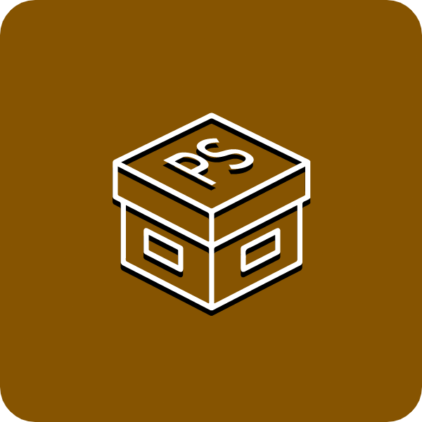

# ProdStorage 

O ProdStorage é um inventário de produtos feito em Flutter, onde o usuário pode adicionar um produto com nome, quantidade e valor!

## Mudanças

A partir do <a href='https://www.alura.com.br/artigos/criando-formulario-com-flutter'>artigo</a> publicado pela Alura, fiz a criação de um <a href='https://github.com/CaioLuppo/InventariodeProdutos/releases/tag/FimDoArtigo'>app simples</a> onde apenas existiam inputs e o botão de confirmar.

Porém, com meus conhecimentos, realizei a implementação de uma lista de produtos que mostra todos os itens cadastrados pelo usuário naquele momento. 😊

Ainda é um projeto simples, porém estou em constante aprendizado!

## Última atualização (v1.1.0+1) 🎉

- [x] Produto agora pode ser registrado com imagem
- [x] Sistema de persistência adicionado
- [x] Integração com SQLite (sqflite)
- [x] Ícone adicionado
- [x] Nome do aplicativo alterado para "ProdStorage"
- [x] Tema claro e escuro

>- [x] Corrigido o bug da lista que sumia
